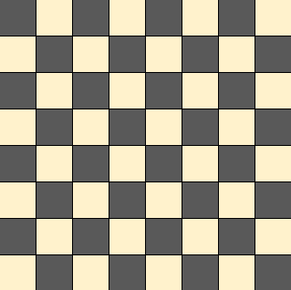

# Trabajo Parcial

### Profesor

- Canaval Sanchez, Luis Martin

### Integrantes

- Garro Vega, Marcelo Fabian (u20201c410)
- Gutierrez Aranda, Raúl Nikolay (u20201f048)
- Chirito Torres, Jose Raul (u20201a293)

### Tema

Damas Chinas (Checkers)

## Descripción del problema

<!--
▪ El problema deberá representar una situación de la vida real susceptible a ser representada por sus datos a través de un grafo.
▪ Este problema representado en un grafo deberá poder ser recorrido a través de una o más técnicas de búsqueda con el propósito de encontrar posibles soluciones (o la mejor).
-->

El juego de damas chinas (checkers), plantea un desafío extraordinario en el ámbito de la complejidad algorítmica, lo que lo convierte en un campo fértil para el desarrollo de algoritmos capaces de emular la toma de decisiones de un jugador automatizado, comúnmente conocido como "bot". Este juego presenta una profundidad estratégica y un espacio de búsqueda significativamente amplio que requiere una cuidadosa consideración y planificación por parte de cualquier programa de inteligencia artificial que busque competir a un nivel competitivo con jugadores humanos.

## Descripción y visualización del conjunto de datos (datasets)

Consideraciones:

El tablero de damas tendrá un tamaño equivalente a 64 casillas distribuidas,
lo que se traduce aproximadamente en un tablero de 8x8 como se muestra a continuación:

Deberá haber al menos 64 posiciones distintas en total en el tablero, incluyendo las casillas vacías y las ocupadas por fichas.

Para completar el sistema de búsqueda de rutas en el juego de damas, es necesario agregar información al grafo del tablero, considerando las reglas del juego para determinar cómo se puede mover una ficha de una posición a otra.

## Propuesta

<!-- Redactar de forma preliminar, el objetivo de la propuesta, técnica y metodología a utilizar. -->

El objetivo de esta propuesta es desarrollar un algoritmo para el juego de damas que sea capaz de jugar de manera inteligente y estratégica contra un oponente humano y computadora. El algortimo a utilizar es **minimax** para tomar decisiones óptimas y mejorar su desempeño en el juego de damas, teniendo en cuenta las condiciones de cada movimiento de las piezas del juego.

## **NUEVO** Diseño de Aplicativo

En la concepción y desarrollo de nuestro proyecto de Damas Chinas, o tambien conocido como Checkers, encontramos una mejor facilidad para la creación de interfaces de juegos en pygame. A comparación de Tkinter, Pygame cuenta con una sintaxis que cualquier programador principiante puede lograr a entender el funcionamiento del game loop que proporciona este.

El programa que hemos creado ofrece a los usuarios una experiencia interactiva única. A través de la manipulación del ratón, se les permite mover estratégicamente sus fichas en diagonal, ya sea para avanzar en el tablero o para capturar las preciadas piezas del oponente. Este enfoque intuitivo de juego añade un componente dinámico y táctico a la experiencia de Damas Chinas.

Además, incorporamos un bot con capacidades de movimiento similares a las del usuario, pero con un giro intrigante: está completamente gestionado por la máquina, aprovechando el poder del algoritmo de minimax. Esta adición no solo proporciona desafíos adicionales para los jugadores, sino que también destaca la capacidad del programa para enfrentarse a estrategias complejas mediante la toma de decisiones automatizada.
